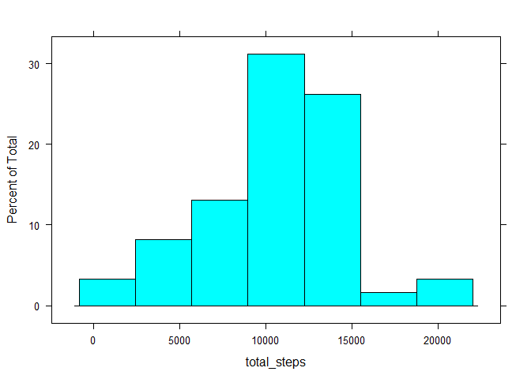
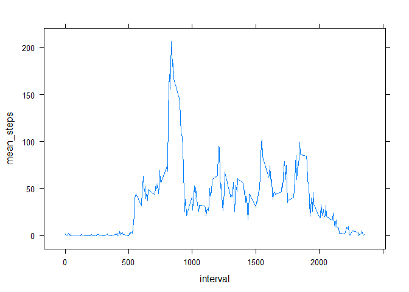
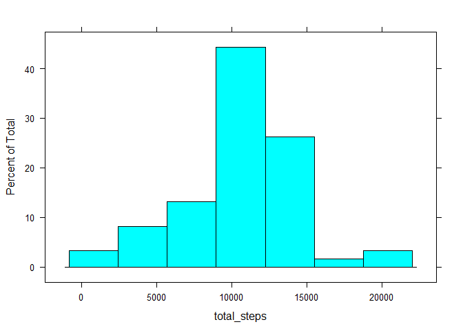
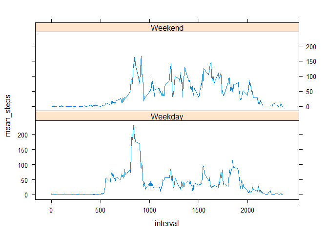

# Reproducible Research: Peer Assessment 1

This report presents some analysis on the number of steps taken by people wearing activity monitoring devices.

## Loading and preprocessing the data
The data is loaded from a CSV into a datatable.

```r
library(data.table)
library(lattice)
options(scipen=999)
data <-  read.csv("./activity.csv",stringsAsFactors=FALSE)
dt <- data.table(data)
```


## What is mean total number of steps taken per day?

###1. Make a histogram of the total number of steps taken each day

```r
totalStepsPerDay <- dt[,list(total_steps=sum(steps)),by=date]
histogram(~total_steps, totalStepsPerDay)
```

 

```r
meanSteps <- round(mean(totalStepsPerDay$total_steps,na.rm=T),digits=2)
medianSteps <-  round(median(totalStepsPerDay$total_steps,na.rm=T),digits=2)
```

###2. Calculate and report the mean and median total number of steps taken per day
The mean number of steps in a day is 10766.19 and the median number of steps in a day is 10765.


## What is the average daily activity pattern?
###1. Make a time series plot (i.e. type = "l") of the 5-minute interval (x-axis) and the average number of steps taken, averaged across all days (y-axis)

```r
meanStepsPerInterval <- dt[,list(mean_steps=mean(steps,na.rm=T)),by=interval]
xyplot(mean_steps~interval, meanStepsPerInterval, type='l')
```

 

###2. Which 5-minute interval, on average across all the days in the dataset, contains the maximum number of steps?

```r
maxInterval <- meanStepsPerInterval[which.max(meanStepsPerInterval[,mean_steps]),interval]
```
The interval with the highest mean number of steps is 835.


## Imputing missing values
###1.Calculate and report the total number of missing values in the dataset (i.e. the total number of rows with NAs)

```r
incompleteCaseCount <- sum(!complete.cases(dt))
```
There are 2304 rows with NA's.

###2. Devise a strategy for filling in all of the missing values in the dataset. The strategy does not need to be sophisticated. For example, you could use the mean/median for that day, or the mean for that 5-minute interval, etc.
###3. Create a new dataset that is equal to the original dataset but with the missing data filled in.
The missing values are replaced with the mean for that interval.

```r
dt <- merge(dt, meanStepsPerInterval, by="interval")
dt$steps <- ifelse(is.na(dt$steps), dt$mean_steps, dt$steps)
```
###4. Make a histogram of the total number of steps taken each day and Calculate and report the mean and median total number of steps taken per day. Do these values differ from the estimates from the first part of the assignment? What is the impact of imputing missing data on the estimates of the total daily number of steps?

```r
totalStepsPerDay <- dt[,list(total_steps=sum(steps)),by=date]
histogram(~total_steps, totalStepsPerDay)
```

 

```r
meanSteps <- round(mean(totalStepsPerDay$total_steps,na.rm=T),digits=2)
medianSteps <-  round(median(totalStepsPerDay$total_steps,na.rm=T),digits=2)
```

The updated mean number of steps in a day is 10766.19 and the median number of steps in a day is 10766.19. By definition, adding additional samples with the mean value has no effect on the mean number of steps taken in a day but the median increases slightly.

## Are there differences in activity patterns between weekdays and weekends?
###1. Create a new factor variable in the dataset with two levels - "weekday" and "weekend" indicating whether a given date is a weekday or weekend day.

```r
dt$dayType <- factor(ifelse(weekdays(as.Date(dt$date)) %in% c("Saturday","Sunday"), "Weekend", "Weekday"))
```

###Make a panel plot containing a time series plot (i.e. type = "l") of the 5-minute interval (x-axis) and the average number of steps taken, averaged across all weekday days or weekend days (y-axis).

```r
meanStepsPerIntervalByDayType <- dt[,list(mean_steps=mean(steps,na.rm=T)),by=list(interval = dt$interval, dayType = dt$dayType)]
xyplot(mean_steps~interval | dayType, meanStepsPerIntervalByDayType, type='l',layout=c(1,2))
```

 
